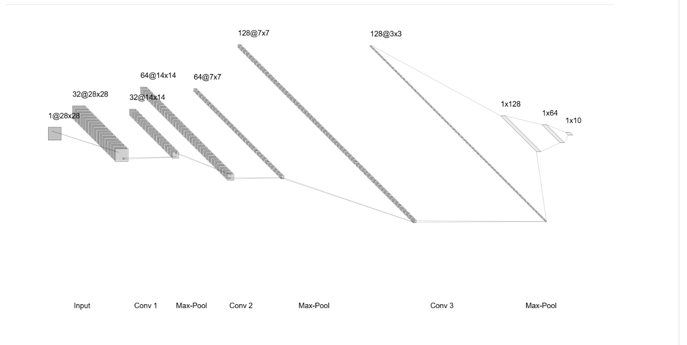
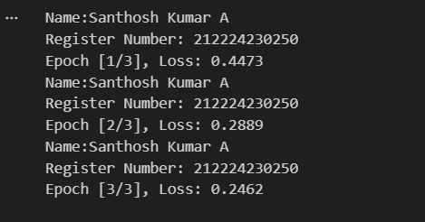
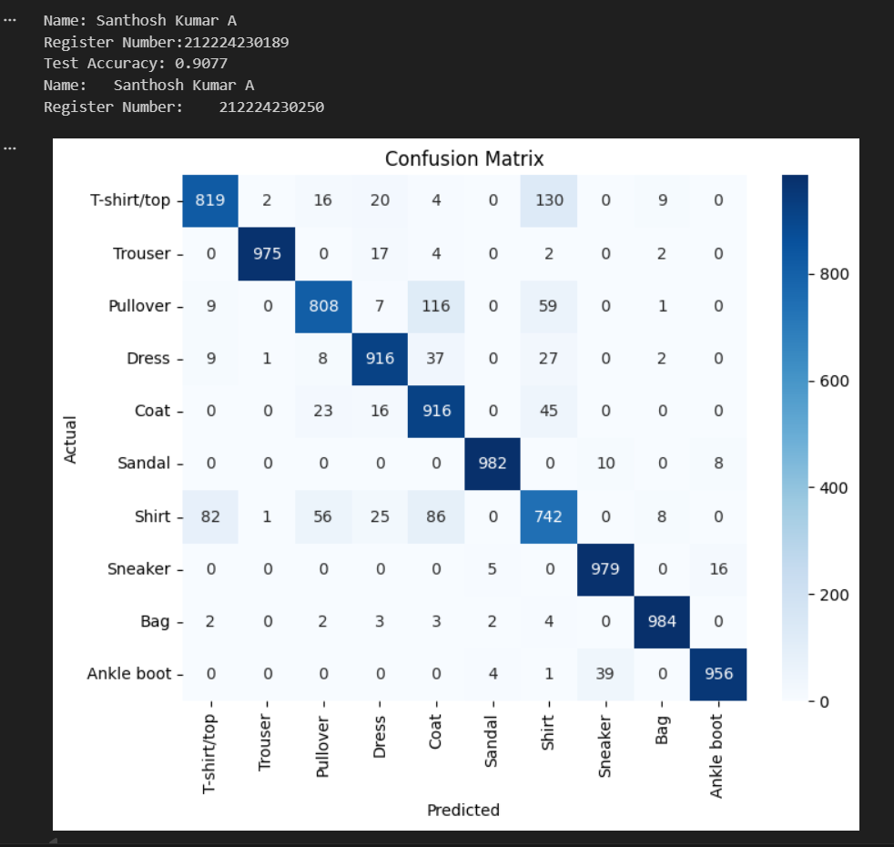
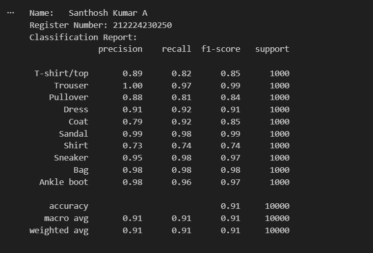
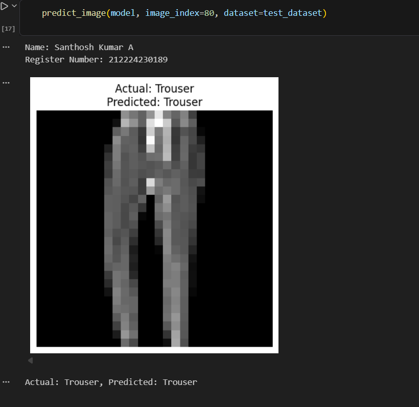

# Convolutional Deep Neural Network for Image Classification

## AIM

To Develop a convolutional deep neural network for image classification and to verify the response for new images.

## Problem Statement and Dataset

Include the Problem Statement and Dataset.

## Neural Network Model



## DESIGN STEPS

STEP 1: Problem Statement
Define the objective of classifying handwritten digits (0-9) using a Convolutional Neural Network (CNN).

STEP 2:Dataset Collection
Use the MNIST dataset, which contains 60,000 training images and 10,000 test images of handwritten digits.

STEP 3: Data Preprocessing
Convert images to tensors, normalize pixel values, and create DataLoaders for batch processing.

STEP 4:Model Architecture
Design a CNN with convolutional layers, activation functions, pooling layers, and fully connected layers.

STEP 5:Model Training
Train the model using a suitable loss function (CrossEntropyLoss) and optimizer (Adam) for multiple epochs.

STEP 6:Model Evaluation
Test the model on unseen data, compute accuracy, and analyze results using a confusion matrix and classification report.

STEP 7: Model Deployment & Visualization
Save the trained model, visualize predictions, and integrate it into an application if needed.
## PROGRAM

### Name: SANTHOSH KUMAR A
### Register Number: 21224230250
```
class CNNClassifier(nn.Module):
    def __init__(self):
        super(CNNClassifier, self).__init__()

        self.conv1 = nn.Conv2d(1, 32, kernel_size=3, padding=1)
        self.conv2 = nn.Conv2d(32, 64, kernel_size=3, padding=1)

        self.pool = nn.MaxPool2d(kernel_size=2, stride=2)
        self.relu = nn.ReLU()

        self.fc1 = nn.Linear(64 * 7 * 7, 128)
        self.fc2 = nn.Linear(128, 10)

        self.dropout = nn.Dropout(0.25)

    def forward(self, x):

        x = self.pool(self.relu(self.conv1(x)))
        x = self.pool(self.relu(self.conv2(x)))

        x = x.view(x.size(0), -1)

        x = self.dropout(self.relu(self.fc1(x)))
        x = self.fc2(x)

        return x


```


# Initialize the Model, Loss Function, and Optimizer
```
device = torch.device("cuda" if torch.cuda.is_available() else "cpu")
model = CNNClassifier().to(device)
criterion = nn.CrossEntropyLoss()
optimizer = optim.Adam(model.parameters(), lr=0.001)

```


# Train the Model
```

def train_model(model, train_loader, num_epochs=3):
    model.train()
    for epoch in range(num_epochs):
        running_loss = 0.0
        for images, labels in train_loader:
            images, labels = images.to(device), labels.to(device)
            optimizer.zero_grad()
            outputs = model(images)
            loss = criterion(outputs, labels)
            loss.backward()
            optimizer.step()
            running_loss += loss.item()

        print('Name: SANTHOSH KUMAR A')
        print('Register Number: 212224230250')
        print(f'Epoch [{epoch+1}/{num_epochs}], Loss: {running_loss/len(train_loader):.4f}')

```

## OUTPUT
### Training Loss per Epoch



### Confusion Matrix



### Classification Report



### New Sample Data Prediction



## RESULT

Thus, We have developed a convolutional deep neural network for image classification to verify the response for new images.

